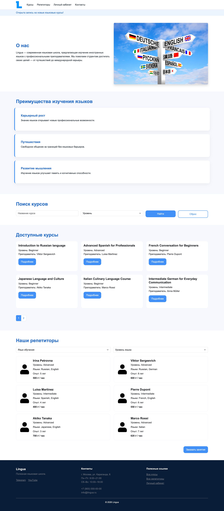
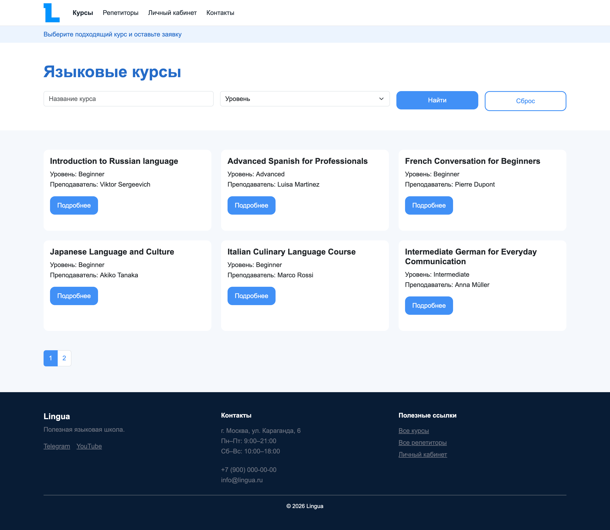
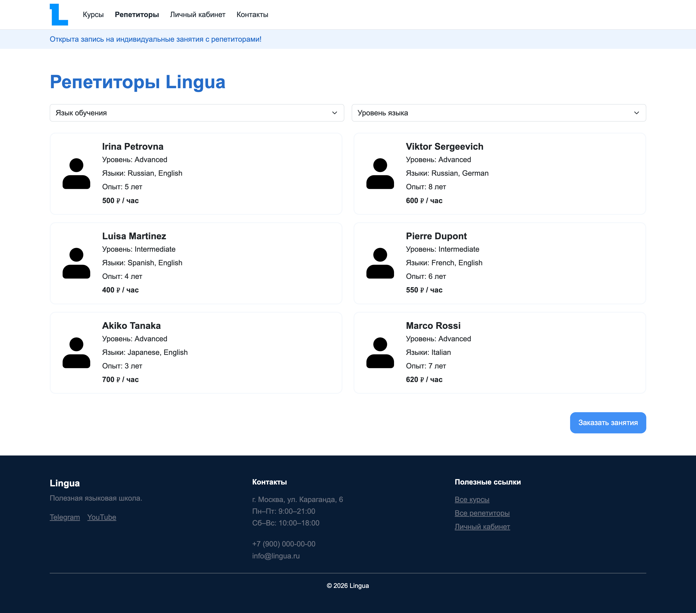
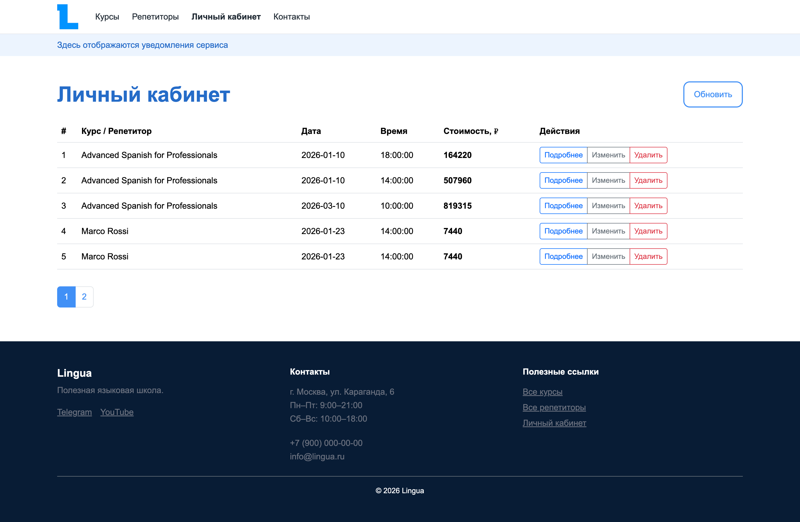
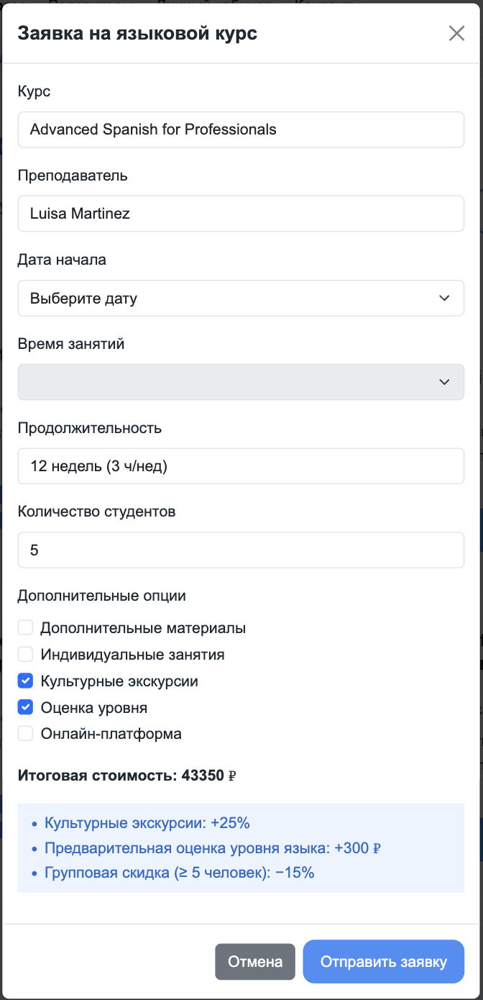
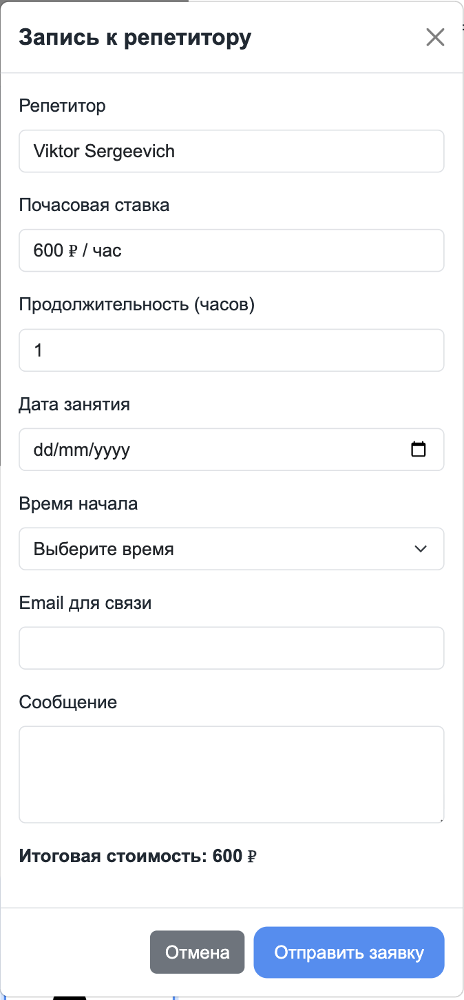
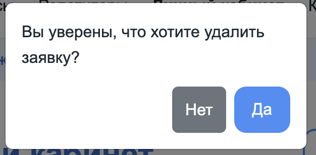
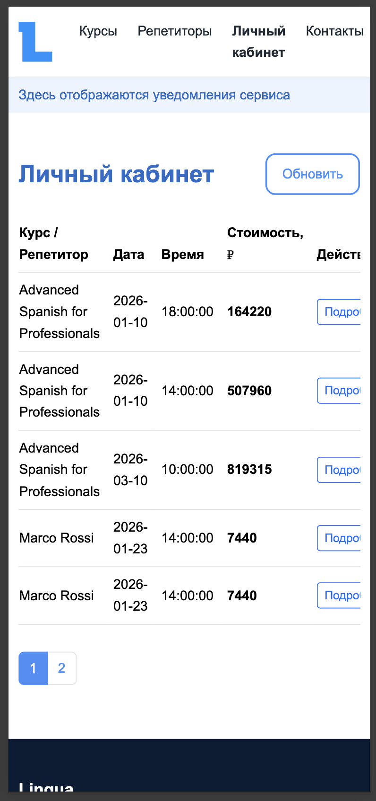
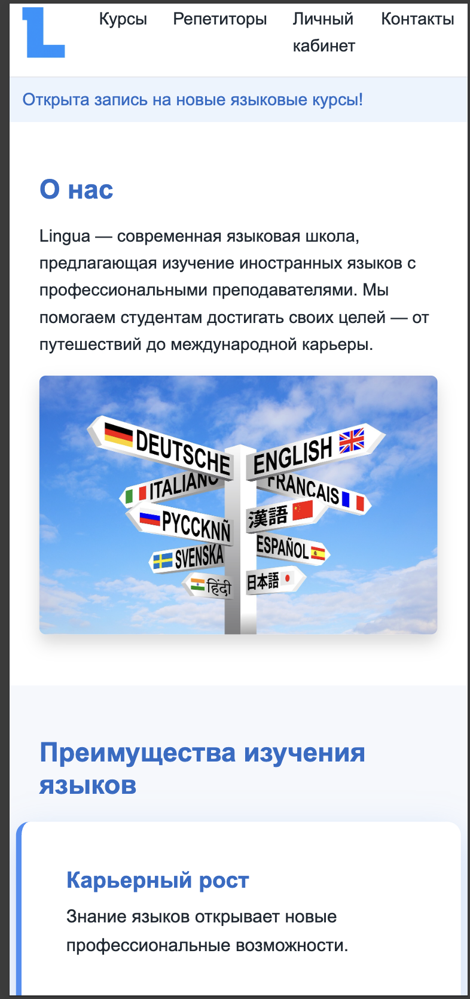

# Web-Technology-exam
Выполнил: Кадетов Григорий Евгеньевич 241-326

Для просмотра сайта, склонируйте репозиторий и откройте в браузере `index.html`.
## Основной функционал

- Просмотр языковых курсов
- Поиск и фильтрация курсов
- Просмотр репетиторов и запись на индивидуальные занятия
- Оформление заявок на курсы и репетиторов
- Личный кабинет пользователя
- Редактирование и удаление заявок
- Клиентская пагинация
- Работа с REST API (GET / POST / PUT / DELETE)
- Модальные окна для всех ключевых действий

---

## Главная страница

**Скриншот главной страницы**

---

## Страница курсов

Отдельная страница с выделенным функционалом из главной страницы для курсов.

**Скриншот страницы курсов**

---

## Страница репетиторов

Отдельная страница с выделенным функционалом из главной страницы для репетиторов.

**Скриншот страницы репетиторов**

---

## Личный кабинет

Личный кабинет пользователя позволяет:
- Просматривать список всех заявок
- Просматривать подробную информацию о заявке
- Редактировать существующие заявки
- Удалять заявки

**Скриншот личного кабинета**

---

## Модальные окна

### Просмотр курса

---

### Подача заявки на курс

---

### Подача заявки на репетитора

---

### Просмотр заявки

---

### Редактирование заявки

Для курса:

Для репетитора:

---

### Удаление заявки

Удаление заявки сопровождается модальным окном подтверждения

## Адаптация

Пример для телефонов:

    
    
    

